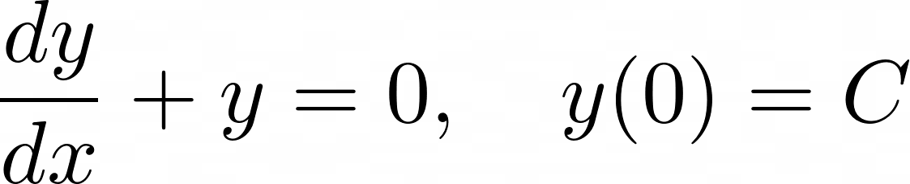
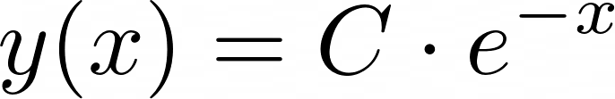
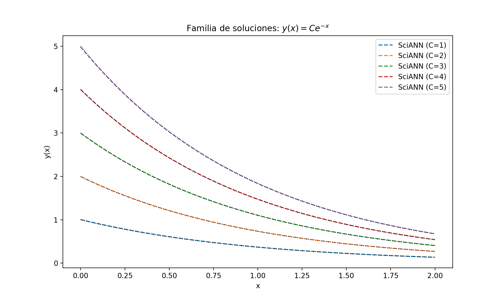
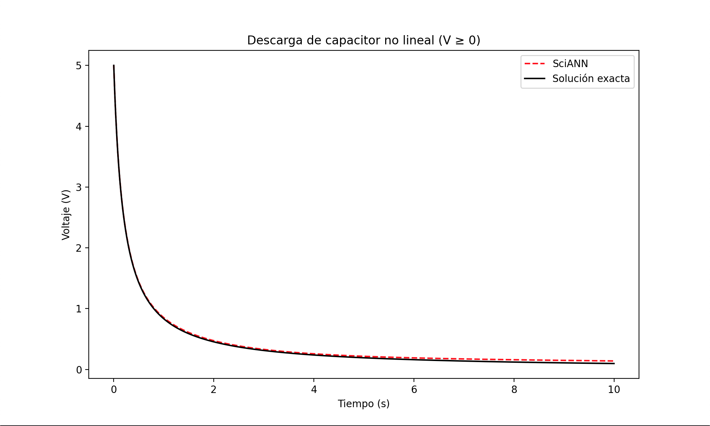

# Búsqueda de Soluciones de Ecuaciones Diferenciales utilizando Redes Neuronales

Investigación acerca del uso de redes neuronales para la búsqueda de soluciones de ecuaciones diferenciales.
<!-- , iniciado como parte de una iniciación científica por profesores del Centro de Docencia de Ciencias Básicas para Ingeniería, de la Universidad Austral de Chile. -->

Profesores responsables: 

* **Juan Concha**

* **Daniel Sánchez**

---
Para más detalles, revisar el documento a continuación:

https://github.com/aretesatori/solve-differential-equations/blob/main/notebook.ipynb


<!-- ---
## Bibliotecas

* SciANN (Tensorflow/Keras)

* _DeepXDE \[**Descartada porque el artículo no es de acceso libre**\]_

* NeuralPDE.jl (Julia) \[**No es una biblioteca de Python**\]


---
## Importante

> Versión de Python utilizada: **Python 3.10.16**.

* Para instalar la versión dentro de un entorno ya creado en Conda:

``` bash 
conda install python=3.10 
```

* Para verificar la versión instalada:

``` bash 
python --version
```


**Nota: Los códigos acá presentes se ejecutan dentro de un entorno virtual, con versiones específicas de Tensorflow, Keras y SciANN.**

---
## Instalación de SciANN

1. Instalar Tensorflow (2.10.1)

``` bash 
pip install "tensorflow>=2.10,<2.11" 
```

2. Instalar Keras (2.10.0)

``` bash 
pip install "keras<3.0,<2.11" 
```

3. Instalar SciANN (0.7.0.1)

``` bash 
pip install sciann 
```

4. Instalar Matplotlib (3.10.3)

``` bash 
pip install matplotlib 
```

---
# Ejemplo 1: Resolución de una EDO Lineal de Primer Orden

Corresponde a un simple problema con solución analítica, implementada para probar la biblioteca SciANN.

Ecuación 1:

<p align="center">
    
</p>

Solución general:

<p align="center">
    
</p>

Con C una constante.

Una vez obtenida la predicción de la solución para la Ecuación 1, se realiza la gráfica (utilizando Matplotlib) para C = 1, C = 2, C = 3, C = 4, C = 5

Las curvas generadas por SciANN están en los colores indicados. La curva de la solución exacta está en color negro.

<p align="center">
    
</p> -->


<!-- ## Código

``` python
import sciann as sn
import numpy as np
import matplotlib.pyplot as plt

# Definir variables
x = sn.Variable('x', dtype='float32')
C = sn.Variable('C', dtype='float32')  # Constante para la familia de soluciones

# Red neuronal para aproximar y(x; C)
y = sn.Functional('y', [x, C], 4*[20], activation='tanh')

# Derivada dy/dx
dydx = sn.diff(y, x)

# Ecuación diferencial: dy/dx + y = 0
ode = dydx + y

# Condición inicial: y(0; C) = C
IC = (1 - sn.sign(x - 0.01)) * (y - C)

# Modelo
model = sn.SciModel(
    inputs=[x, C],
    targets=[ode, IC],
    loss_func="mse",
    optimizer="adam",
)

# Datos de entrenamiento (x ∈ [0, 2], C ∈ [0.5, 5])
x_train = np.linspace(0, 2, 100)
C_train = np.linspace(0.5, 5, 50)
X, Cc = np.meshgrid(x_train, C_train)
X_flat = X.reshape(-1, 1)
Cc_flat = Cc.reshape(-1, 1)

# Entrenamiento
model.train(
    [X_flat, Cc_flat],
    ['zeros', 'zeros'],
    epochs=500,
    batch_size=256,
    verbose=0
)

# Predicción para C = 1, 2, 3, 4, 5
x_test = np.linspace(0, 2, 100)
C_test = [1, 2, 3, 4, 5]

plt.figure(figsize=(10, 6))
for c in C_test:
    # Solución numérica con SciANN
    y_pred = y.eval(model, [x_test, c * np.ones_like(x_test)])
    # Solución analítica utilizando 
    y_exact = c * np.exp(-x_test)
    plt.plot(x_test, y_pred, '--', label=f'SciANN (C={c})')
    plt.plot(x_test, y_exact, 'k:', linewidth=1)

plt.xlabel('x')
plt.ylabel('y(x)')
plt.title('Familia de soluciones: $y(x) = C e^{-x}$')
plt.legend()
plt.show()
```


---
# Ejemplo 2: Resolución de una EDO No Lineal de Primer Orden

Corresponde a un ejemplo de sistema eléctrico modelado, en el que se requieren soluciones **positivas** y **conservativas**.

Orientado a modelar el comportamiento físico de un circuito RC no lineal, donde el voltaje del capacitor *V(t)* debe ser siempre positivo debido a la presencia de un diodo ideal. La ecuación diferencial incluye un término no lineal para modelar la disipación de energía, garantizando que *V(t)* sea mayor o igual a *0*.

<p align="center">
    
</p> -->


---
# Referencias

## Docs

* SciANN Documentation (https://www.sciann.com/)

## Artículos

* E. Haghighat, R. Juanes, _SciANN: A Keras/TensorFlow wrapper for scientific computations and physics-informed deep learning using artificial neural networks_ (https://www.sciencedirect.com/science/article/abs/pii/S0045782520307374)


